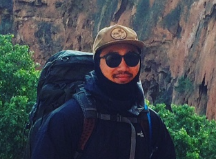

{:.avatar}

#Vincent Hoang
Computer Science Student and Technology aficionado

<a href="mailto:">vincenthoang00@gmail.com</a>
|
<i class="fa fa-github"></i> <a href="https://github.com/vhoangssf">my account</a>
|
<i class="fa fa-twitter"></i> <a href="http://twitter.com/">mytwitteraccount</a>

## Currently

I am a student at Soft Stack Factory, a JavaScript coding bootcamp. 
## Education

`2005-2009`
__University of California, Irvine__ Bachelor's degree in Earth System Science

## Technical skills

* HTML and CSS
* Javascript

## Projects

### CV

I created a this web page to show off my CV.  

## Achievements

Achievement 1

Achievement 2

## Experience

`2010-11`
__Roasted Bean Coffe House__ 
 Worked for two summers on the Roasted Bean Coffe House as a barista.

## Hobbies

* Hiking/Backpacking
* Surfing
* Cooking
* Freedive/Spearfishing

## Links

* <i class="fa fa-envelope"></i> <a href="mailto:">vincenthoang00@gmail.com</a> 
* <i class="fa fa-github"></i> <a href="http://github.com/vhoangssf">my account</a> 
* <i class="fa fa-twitter"></i> <a href="http://twitter.com/">mytwitteraccount</a> 
* <i class="fa fa-stack-overflow"></i> <a href="http://stackoverflow.com/">SO Account</a>
* <i class="fa fa-google"></i> <a href="http://scholar.google.com/">scholar</a>
